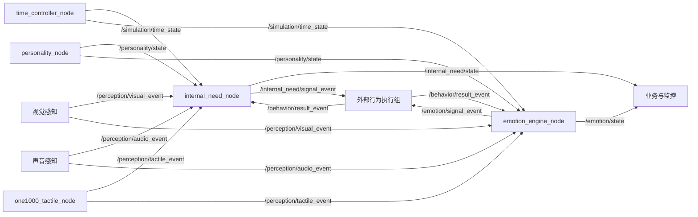
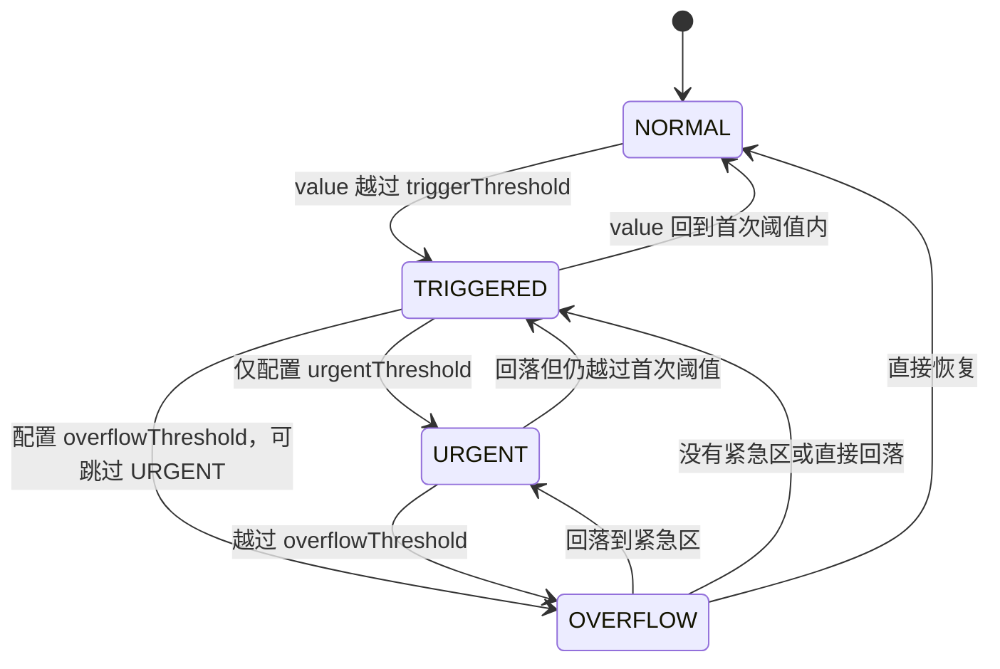
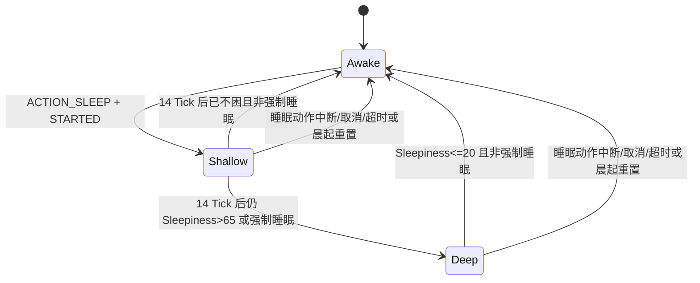

# 处理逻辑

## 组件关系



仓库内没有从需求/情绪信号到具体动作的选择、仲裁或执行代码；图中的“外部行为执行组”必须由其他模块实现。

## 消息处理顺序

### 感知到情绪

1. ROS2 String 解析为 JSON 对象；失败则忽略。
2. 音频/触觉读取单个 `event_type`；视觉读取 `events` 列表或字符串。
3. 查找 `configs/emotions.yaml:eventRules`；未知事件忽略。
4. 以事件名和本节点单调时钟执行 10 秒去重；窗口内重复则忽略。
5. 遍历事件映射的各情绪，依次计算 `round(基础值 × 性格系数 × metadata倍率)`。
6. 每次写入限制到 0..100，并触发已注册的内部情绪变化回调。
7. 保存 `lastEmotionEventResult`。
8. 节点立即检查并发布新进入阈值的情绪信号；不会立即发布完整 `/emotion/state`。

### 感知到需求

- 视觉 `EVT_VISION_MASTER`：设置主人在场。
- 音频 `EVT_VOICE_MASTER_ID`、`EVT_VOICE_CALL_NAME`：设置主人在场。
- 触觉：当前只返回接收到的事件名，无数值副作用。
- 感知回调结束后仍会检查需求等级变化；如果没有副作用就不会发布新需求信号。

### 行为结果到需求

1. 校验动作、结果、metadata 和可选需求映射。
2. 若有 `event_id`，检查本需求系统最近 256 个 ID；重复则停止。
3. `ACTION_SLEEP + STARTED`：进入浅睡。
4. `INTERRUPTED/CANCELLED/TIMEOUT`：睡眠动作先唤醒，再降低映射需求。
5. 只有 `COMPLETED` 进入完成结算；`FAILED` 不改变需求。
6. 完成结算成功后，把主动作需求加入“仍激活重发”集合。
7. 节点检查等级变化或同级重发并发布需求信号。

### 行为结果到情绪

1. 使用同样的结构校验和独立 ID 去重表。
2. `COMPLETED` → DemandSatisfied。
3. `FAILED/TIMEOUT` → DemandUnsatisfied。
4. `INTERRUPTED/CANCELLED` → ActionInterrupted。
5. `STARTED` 不改变情绪。
6. 节点立即检查情绪上升沿或 Calm 兜底信号。

同一个行为结果分别由需求、情绪两个订阅回调处理，执行顺序没有跨节点保证；调用方应通过 `event_id` 保证单节点幂等，不应依赖两个输出的先后顺序。

## 需求 Tick 顺序

每个到期的虚拟 10 分钟 Tick，内部顺序固定为：

```text
Energy
  → 判断 00:00..06:00 全局锁定
  → 锁定：只更新 Sleepiness，然后结束
  → 若应晨起重置：重置非 Energy 需求、必要时唤醒，然后结束
  → Hunger
  → Bladder
  → Sleepiness
  → Cleanliness
  → Social
  → Exploration
```

顺序会影响同一个 Tick 的 Exploration：Energy 先耗电，Exploration 再用更新后的 `Energy < 50` 判断是否增长。

## 需求等级状态机



代码不是逐级迁移，而是每次按当前值直接计算最终等级，所以允许 NORMAL 一次跳到 OVERFLOW，也允许 OVERFLOW 一次回到 NORMAL。每次最终等级与快照不同只发一条最终等级事件。

## 需求信号边沿

- 系统创建时保存初始等级快照，初始 NORMAL 不发布 RECOVERED。
- 等级变化后，下一次检查发布一条事件并更新快照。
- 多个需求同一次更新跨级时，按需求字典顺序发布：Hunger、Bladder、Sleepiness、Cleanliness、Energy、Social、Exploration。
- `COMPLETED` 后主需求仍在同一激活等级，额外重发当前事件，原因 `ACTION_RESULT_STILL_ACTIVE`。
- 如果动作完成让需求跨级，则只发正常的 `LEVEL_CHANGED`，不会再多发同级重发。

## 情绪信号状态机

每个普通情绪只有“未触发/触发”两态：

```text
未触发 --达到阈值--> 触发：发布一次
触发 --继续处于阈值内--> 触发：不发布
触发 --跌破阈值--> 未触发：不发布恢复事件
未触发 --再次达到阈值--> 触发：再次发布
```

Calm 不使用这个上升沿逻辑。没有任何普通情绪触发时，每次检查都发布 Calm；任一普通情绪触发后不发布 Calm。

## 睡眠状态机



`sleepActionAllowed` 只表示触发条件成立，不会自动进入睡眠；必须由外部行为组发 `ACTION_SLEEP + STARTED`。

## 时间与状态输出

- 权威时间节点按虚拟秒发布时间。
- 需求系统按虚拟 10 分钟更新，但需求状态按真实 1 Hz 发布。
- 情绪状态在普通模式按每个虚拟秒发布；高倍率时频率随倍率增长。
- 情绪衰减和 Calm 检查按真实 1 Hz，和状态发布频率是两套调度器。
- 所有需求/情绪状态与信号带墙上 `timestamp` 和独立的虚拟 `timeContext`。
